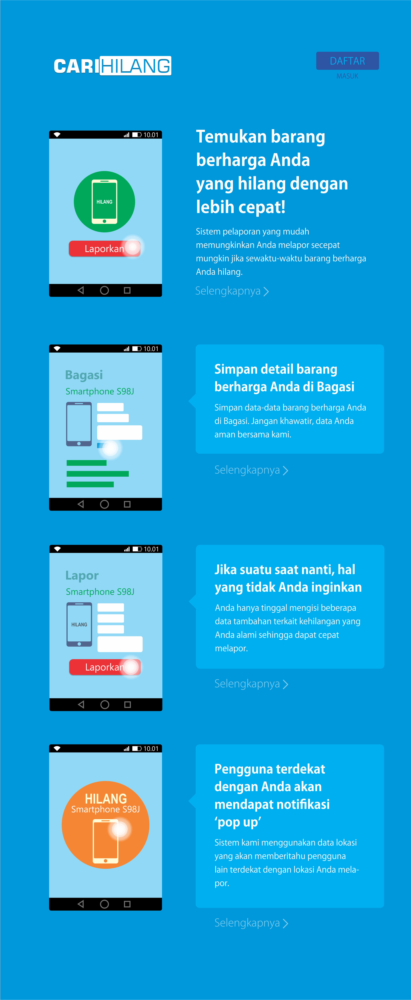

# Tugas Akhir Semester I Kuliah Pemrograman Web I

**[BELUM SELESAI]**

**FOLDER INI UNTUK PENILAIAN, MOHON TIDAK MENYALAHGUNAKAN FITUR _FORK_, _CLONE_, ATAU MEKANISME PENYALINAN LAINNYA.**

Folder ini dapat diakses sebagai versi halaman web di https://salimromadhon.github.io/web/responsi-web-1/

## Desain Awal

Kami membuat desain awal melalui **Corel Draw** sebagai berikut.

Kami melakukan banyak perombakan dalam merealisasikan halaman web sehingga tampilan di https://salimromadhon.github.io/web/responsi-web-1/
bisa dikatakan menjadi sangat berbeda dari desain awal kami di atas.
